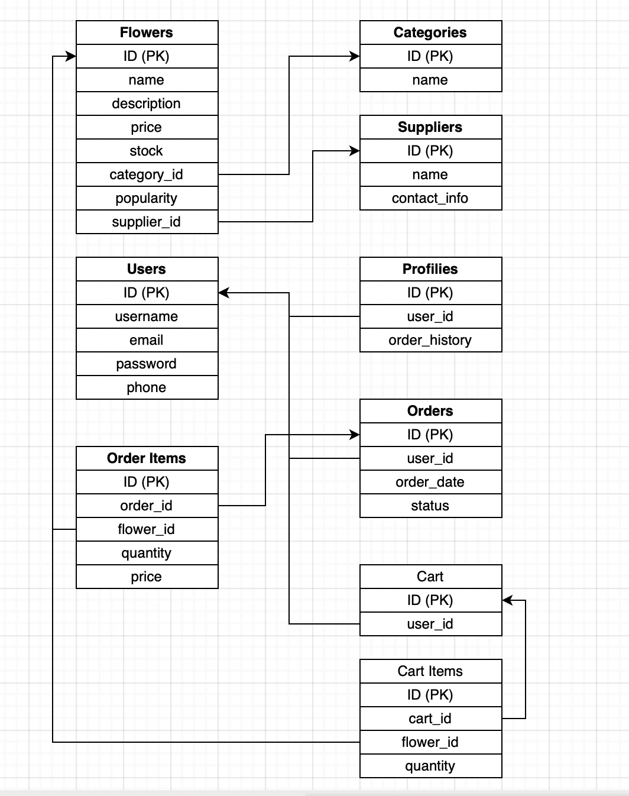

# Flowers Store

## Description
This is a web application for an online flower shop of my mother. 

The site allows customers to browse flowers and bouquets, search by name, filter by type or price, sort results.  

Customers can view detailed product information, add flowers to a shopping cart.  

Registered users can manage their profilies, check order history, and edit their data.  

Administartors can manage products, categories and suppliers.  

### How to setup the project

**Backend setup**

**Requirements:**
- Python 3.10+
- Django 4+
- Django REST Framework
- django-rest-framework-simplejwt
- django-cors-headers

**Clone this repository**
- git clone https://github.com/urkarnad/flowers-store.git
- cd flowers-shop

**Create virtual environment**
- python -m venv venv

*Windows*
- venv\Scripts\activate

*Mac/Linux*
- source venv/bin/activate

**Install the requirements**
- pip install -r requirements.txt

**Database migrations**
- python manage.py makemigrations
- python manage.py migrate

**Starting the server**
- python manage.py runserver

## API Endpoints  
 

**JSON** format reponses.  

### Flowers  

**GET /api/v1/flowers**  

Get a list of flowers with optional filters  

Example:  

    - Parameters: '?search=tulip&sort=price_asc'  

    - Response: `200 OK`, `[ {"id":1, "name":"Tulip", "price":50, "type":"bouquet"} ]`  

**GET api/v1/flowers/{id}**  

Get detailed information about a flower.  

Ex.:  

    Response: `200 OK`, `{ "id":1, "name":"Tulip", "description":"Red tulip", "price":50,  "category":"Bouquet", "supplier":"Jan de Wit en Zonen B.V." }`

**POST /api/v1/flowers** *(admin only)*  

Add a new flower.  

Ex.:  

    Body: `{ "name":"Tulip", "price":50, "category_id":2, "supplier_id":1 }`  
    Response: `201 Created`  

**PUT /api/v1/flowers/{id}** *(admin only)*  

Update flower details.  

Ex.:  

    Response: `200 OK`  

**DELETE /api/v1/flowers/{id}** *(admin only)*  

Delete flower.  

Ex.:  

    Response: `204 No Content`  

### Categories  

**GET /api/v1/categories**  

Get a flower categories (e.g., bouquets, indoor plants, gifts)  

Ex.:  

    Response: `200 OK`, `[ { "id":1, "name":"Bouquets" } ]`  

**GET /api/v1/categories/{id}/flowers**  

Get all flowers in a specific category.  

### Suppliers  

**GET /api/v1/suppliers**  

Get all suppliers.  

Ex.:  

    Response: `200 OK`  

**GET /api/v1/suppliers/{id}/flowers**  

    Get flowers from a specific supplier.  

### Cart  

**GET /api/v1/cart** *(authorized users only)*  

Get current user's cart.  

Ex.:  

    Response: `200 OK`, `{ "items":[ { "flower":"Tulip", "quantity":2, "price":50 } ], "total":100 }`  

**POST /api/v1/cart_item** *(authorized users only)*  

Add a flower to cart.  

Ex.:  

    Body: `{ "flower_id":1, "quantity":2 }`  

    Response: `201 Created`  

**DELETE /api/v1/cart/{flower_id}** *(authorized users only)*  

Remove flower from cart.  

### Users  

**POST /api/v1/users/signup/**  

Register a new user.  

Ex.:  

    Body: `{ "username":"Theodora", "password":"1234", "email":"helloProgramistich@example.com" }`
    Response: `201 Created`  

**POST /api/v1/users/login**  

Log in ang get authentication token.

Ex.:

Body:

{

    "username": "daria",

    "password": "VeryStrongPassword1"
}

Response:

{

    "message": "Login success",
    "username": "daria",
    "tokens": {
        "refresh": "eyJhbGciOiJIUzA...",
        "access": "eyJhbGciOiJIUz..."
    }
}

### Information  

**GET /api/v1/about**  

Get info about the shop, delivery etc.  

